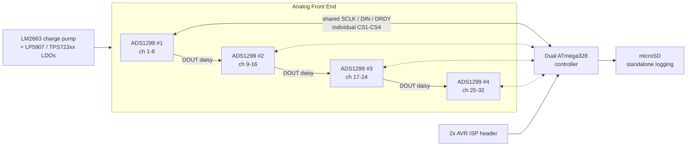

# Adam-EEG

**India's first open-hardware 32-channel EEG / biopotential acquisition board** — a quad-ADS1299 analog front end driven by a dual-ATmega328 controller, designed in EAGLE by [Soul Scientific](https://github.com/shiva16) in 2015.

Adam-EEG packs four Texas Instruments **ADS1299** 24-bit, 8-channel simultaneous-sampling analog front ends onto one board — 32 truly simultaneous EEG channels, daisy-chained over a single SPI bus — with onboard microSD logging for fully standalone (untethered) recording. It's the original prototype in the Adam-EEG lineage: a from-scratch, low-cost, open alternative to research-grade EEG acquisition hardware.

**Also published at:** [Hackaday.io](https://hackaday.io/project/206308-adam-eeg-open-source-32-channel-eeg-board) · [dev.to](https://dev.to/shiva16/adam-eeg-an-open-source-32-channel-eeg-board-from-2015-quad-ads1299-dual-atmega328-2gfi) · [NeuroTechX/awesome-bci](https://github.com/NeuroTechX/awesome-bci#consumer-and-diy-devices) ([merged](https://github.com/NeuroTechX/awesome-bci/pull/92))

---

## Table of contents

- [Why this exists](#why-this-exists)
- [Technical specifications](#technical-specifications)
- [Connectors & pinout](#connectors--pinout)
- [Passive component reference](#passive-component-reference)
- [System architecture](#system-architecture)
- [Repository contents](#repository-contents)
- [Getting started](#getting-started)
- [Safety & disclaimer](#safety--disclaimer)
- [Roadmap](#roadmap)
- [Contributing](#contributing)
- [License](#license)

---

## Why this exists

Research-grade multichannel EEG hardware is expensive and closed. Adam-EEG set out to prove that a **32-channel, simultaneous-sampling, standalone-logging** EEG acquisition board could be built from commodity parts, in a hobbyist CAD tool, at a fraction of the cost — fully open, so anyone can build on it rather than starting from a datasheet.

## Technical specifications

| Subsystem | Detail |
|---|---|
| **Analog front end** | 4 × Texas Instruments **ADS1299** — 24-bit, 8-channel, simultaneous-sampling, low-noise biopotential ADC |
| **Total channels** | **32** unipolar channels + common reference, fully simultaneous (no muxing) |
| **AFE interconnect** | Multi-device SPI **daisy-chain** — shared `SCLK`/`DIN`/`DOUT`/`DRDY`, individual `CS1`–`CS4` per ADS1299 |
| **Controller** | 2 × **ATmega328** (SMD, Arduino-compatible core) |
| **Programming** | 2 × 6-pin AVR ISP headers |
| **Onboard storage** | microSD socket — standalone data logging, no host PC required |
| **Power** | Onboard bipolar analog rail generation: LM2663 switched-capacitor inverter + LP5907 / TPS723xx LDOs for clean split supplies to the AFEs |
| **Clocking** | 2 × crystal oscillators |
| **I/O** | 6 × 1×2, 3 × 1×8, 1 × 1×11, 1 × 1×18 pin headers (electrode + expansion) |
| **Board** | 2-layer, **97.2 × 81.9 mm** (~79.6 cm²), 2 × Ø3.2 mm mounting holes |
| **Complexity** | 354 schematic parts / 229 placed board elements |
| **CAD format** | EAGLE 6.6.0 XML (`.sch` / `.brd`) — single schematic sheet |
| **License** | Apache License 2.0 |

## Connectors & pinout

Extracted directly from the schematic's named nets — real signal names, not inferred from silkscreen alone.

| Connector | Type | Signals | Role |
|---|---|---|---|
| `ARDUINO_CONN` | 1×11 header | `CS1`–`CS4`, `SCLK`, `DIN`, `DOUT`, `DRDY`, `RST`, `PD`, `STRT` | Full SPI daisy-chain + control breakout — lets an external Arduino-compatible host drive all 4 ADS1299 directly, independent of the onboard ATmega328s |
| `ELECTRODES_P&N` | 1×18 header | 18 electrode nets | Primary differential (P/N) electrode input header |
| `ELECTRODES` / `ELECTRODES1` / `ELECTRODES2` | 3× 1×8 header | Per-channel buffered outputs (`1O1`–`8O1`, `1O2`–`8O2`, `1O3`–`8O3`) | Buffered channel-output test/tap points for 3 of the 4 ADS1299s |
| `POWER_PIN` | 1×2 header | `+5V`, `AGND` | Main board power input, feeding the onboard LDO/charge-pump regulation |
| `JP3`–`JP5` | 1×2 jumpers | `DIN`/`JU1`, `DOUT`/`JU2`, `SCLK`/`JU3` | In-line jumpers on the SPI data/clock lines (break/test-point access) |
| `JP1`–`JP2` | 1×2 jumpers | Internal (unlabeled) nets | Present in the schematic; exact function isn't silkscreen-documented — trace before relying on them |

## Passive component reference

Most-used passive values, pulled from the real `value=` attributes in the schematic (useful for a BOM sanity-check or respin):

| Component class | Dominant value | Count | Likely role |
|---|---|---|---|
| Resistor | 5 kΩ | 60 of 69 | Per-channel bias/lead-off network (matches ADS1299's typical RLD topology) |
| Capacitor | 4.7 nF | 48 of 127 | Per-channel input RC filtering |
| Capacitor | 1 µF | 36 of 127 | Local/bulk decoupling |
| Capacitor | 0.1 µF | 28 of 127 | High-frequency decoupling |
| Capacitor | 10 µF / 100 µF | 7 / 4 | Bulk supply-rail reservoirs |
| Crystal | 32.768 kHz (`Y1` or `Y2`, confirmed in schematic text) | 1 of 2 | Real-time/watchdog clock — the second crystal has no frequency called out in the schematic text, verify before assuming a value |

## System architecture

Each ADS1299 samples 8 channels simultaneously; the four devices share one SPI bus in TI's standard multi-device daisy-chain topology, so all 32 channels are read out in lockstep with no channel-to-channel skew.

## Repository contents

| Path | Description |
|---|---|
| `EEG_64_1.zip` | Full EAGLE source — `EEG_64.sch` (schematic) + `EEG_64_1.brd` (board layout) |
| `LICENSE` | Apache License 2.0 |
| `CONTRIBUTING.md` | How to propose changes, report issues, or contribute a fabricated/tested revision |
| `CODE_OF_CONDUCT.md` | Community standards for this repository |
| `.github/` | Issue and pull request templates |

## Getting started

1. Install [Autodesk EAGLE](https://www.autodesk.com/products/eagle/overview) (a free tier is sufficient — this board's ≤80 cm², 2-layer, single-sheet design was scoped to fit within EAGLE's classic free-tier limits).
2. Clone this repo and unzip `EEG_64_1.zip`.
3. Open `EEG_64.sch` for the schematic or `EEG_64_1.brd` for the board layout — both are standard EAGLE XML and can also be inspected with `eagle2kicad`-style converters if you prefer KiCad.
4. Gerbers are not checked in — export them from the `.brd` via EAGLE's CAM processor if you're sending this to fab.

## Safety & disclaimer

This is an **open-hardware research/prototyping board**, not a certified medical device. It has not undergone FDA/CE or equivalent regulatory clearance, and no formal patient-isolation or leakage-current certification has been performed on this design. If you build and use this board:

- Do **not** use it for clinical diagnosis or treatment decisions.
- Power it only from isolated, battery-backed supplies — never connect a build to mains-powered equipment while it is attached to a person.
- Treat it as you would any DIY biopotential-acquisition project: informed use, at your own risk.

## Roadmap

This 2015 quad-ADS1299 board is the original Adam-EEG prototype. It remains a solid, low-cost 32-channel reference design for anyone building EEG/BCI acquisition hardware from scratch. Later Adam-EEG iterations explore denser single-chip AFE options; this repository stays focused on the original, fully-verified quad-ADS1299 design.

## Contributing

Issues and pull requests are welcome — see [CONTRIBUTING.md](CONTRIBUTING.md). Whether it's a routing improvement, a KiCad conversion, a BOM/sourcing update, or a build log from your own fab run, please open an issue first so we can track it.

## License

Apache License 2.0 — see [LICENSE](LICENSE). You are free to use, modify, and distribute this design, including commercially, provided attribution is preserved.
